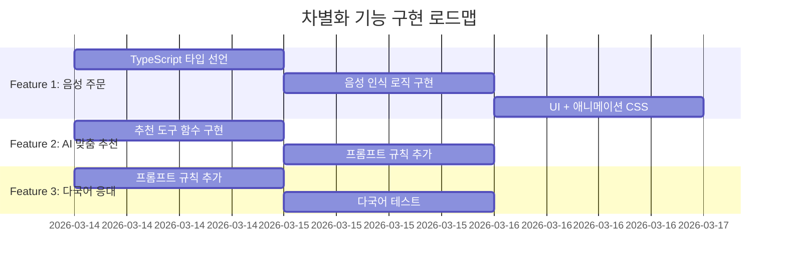

# 🔥 차별화 기능 청사진 (Differentiation Features Blueprint)

> **목표:** 다른 팀과 동일한 기능을 넘어, 프로젝트의 **기술적 깊이와 창의성**을 어필할 수 있는 차별화 포인트 3가지를 구현한다.

---

## Feature 1: 🎙️ 음성 주문 (Voice Ordering)

### 1-1. 개요

| 항목 | 내용 |
|:---|:---|
| **한줄 요약** | 마이크 버튼 하나로 음성으로 주문 가능 |
| **임팩트** | ⭐⭐⭐⭐⭐ — 데모 시연에서 압도적 WOW 효과 |
| **난이도** | ⭐⭐ — Web Speech API 활용, 별도 라이브러리 불필요 |
| **핵심 가치** | 실제 카페 키오스크 UX 재현, 접근성 향상 |

### 1-2. 사용자 시나리오

```
👤 사용자: [마이크 버튼 클릭]
🎙️ 브라우저: "듣고 있다덕..."  (녹음 인디케이터 표시)
👤 사용자: "아메리카노 한 잔 담아줘"
🔄 Speech-to-Text 변환
💬 채팅 입력란에 "아메리카노 한 잔 담아줘" 자동 입력 → 전송
🐤 파덕이: "아메리카노를 장바구니에 담았다덕! 🛒"
```

### 1-3. 기술 스택

| 기술 | 역할 |
|:---|:---|
| **Web Speech API** (`SpeechRecognition`) | 브라우저 내장 음성 인식 (Chrome, Edge 지원) |
| **기존 `handleSend()`** | 변환된 텍스트를 그대로 채팅으로 전송 |

> ⚠️ Web Speech API는 Chrome/Edge에서 가장 안정적. Safari/Firefox는 제한적 지원.

### 1-4. 구현 계획

#### A. AgentChat.tsx 수정

```tsx
// 음성 인식 상태biggest
const [isListening, setIsListening] = useState(false);
const recognitionRef = useRef<SpeechRecognition | null>(null);

// 음성 인식 시작/중지
const toggleVoice = () => {
    if (isListening) {
        recognitionRef.current?.stop();
        setIsListening(false);
        return;
    }

    const SpeechRecognition = window.SpeechRecognition || window.webkitSpeechRecognition;
    if (!SpeechRecognition) {
        alert('이 브라우저에서는 음성 인식을 지원하지 않습니다.');
        return;
    }

    const recognition = new SpeechRecognition();
    recognition.lang = 'ko-KR';           // 🇰🇷 한국어
    recognition.interimResults = true;     // 실시간 중간 결과 표시
    recognition.continuous = false;        // 한 문장 단위
    
    recognition.onresult = (event) => {
        const transcript = Array.from(event.results)
            .map(result => result[0].transcript)
            .join('');
        
        setInputValue(transcript);  // 실시간으로 입력란에 표시
        
        // 최종 결과면 자동 전송
        if (event.results[0].isFinal) {
            handleSend(transcript);
            setIsListening(false);
        }
    };
    
    recognition.onend = () => setIsListening(false);
    recognition.onerror = () => setIsListening(false);
    
    recognitionRef.current = recognition;
    recognition.start();
    setIsListening(true);
};
```

#### B. UI 변경 (입력 영역)

```tsx
{/* Input Area */}
<div className={styles.inputArea}>
    <input
        ref={inputRef}
        type="text"
        placeholder={isListening ? "듣고 있다덕... 🎙️" : "파덕이에게 물어보세요..."}
        value={inputValue}
        onChange={(e) => setInputValue(e.target.value)}
        onKeyDown={(e) => {
            if (e.key === 'Enter' && !e.nativeEvent.isComposing) {
                handleSend(inputValue);
            }
        }}
    />
    <button 
        className={`${styles.voiceBtn} ${isListening ? styles.voiceBtnActive : ''}`}
        onClick={toggleVoice}
        title="음성으로 말하기"
    >
        {isListening ? '⏹️' : '🎤'}
    </button>
    <button className={styles.sendBtn} onClick={() => handleSend(inputValue)}>전송</button>
</div>
```

#### C. CSS 스타일 추가 (AgentChat.module.css)

```css
.voiceBtn {
    background: none;
    border: none;
    font-size: 1.2rem;
    cursor: pointer;
    padding: 8px;
    border-radius: 50%;
    transition: all 0.3s ease;
}

.voiceBtnActive {
    background: rgba(239, 68, 68, 0.15);
    animation: voicePulse 1.5s ease-in-out infinite;
}

@keyframes voicePulse {
    0%, 100% { box-shadow: 0 0 0 0 rgba(239, 68, 68, 0.4); }
    50% { box-shadow: 0 0 0 12px rgba(239, 68, 68, 0); }
}
```

#### D. TypeScript 타입 선언 (global.d.ts)

```typescript
// Web Speech API 타입 선언
interface Window {
    SpeechRecognition: typeof SpeechRecognition;
    webkitSpeechRecognition: typeof SpeechRecognition;
}
```

### 1-5. 구현 우선순위

| 순서 | 작업 | 난이도 |
|:---:|:---|:---:|
| 1 | TypeScript 타입 선언 추가 | ⭐ |
| 2 | AgentChat.tsx에 음성 인식 로직 추가 | ⭐⭐ |
| 3 | 마이크 버튼 UI + 녹음 중 애니메이션 CSS | ⭐ |
| 4 | 에러 처리 (미지원 브라우저, 마이크 권한 거부 등) | ⭐ |

---

## Feature 2: 🧠 AI 맞춤 추천 (주문 이력 기반)

### 2-1. 개요

| 항목 | 내용 |
|:---|:---|
| **한줄 요약** | 과거 주문 내역을 분석하여 개인 취향에 맞는 메뉴를 AI가 추천 |
| **임팩트** | ⭐⭐⭐⭐ — "AI를 단순 응답이 아닌 분석 도구로" 사용한다는 점이 인상적 |
| **난이도** | ⭐⭐ — 기존 `get_my_orders` + Gemini 프롬프트 조합 |
| **핵심 가치** | 넷플릭스·쿠팡 수준의 개인화 추천 경험 |

### 2-2. 사용자 시나리오

```
👤 회원: "뭐 마실까 추천해줘"
🐤 파덕이: [내부적으로 get_my_orders + get_menus 호출]

   📊 분석 결과:
   - 최근 5회 주문 중 4회 아이스 음료
   - 카페라떼 2회, 아메리카노 2회 → 에스프레소 기반 선호
   - 디저트 주문 이력 없음

🐤 파덕이: "주문 내역을 분석해봤다덕! 📊
   회원님은 아이스 에스프레소 음료를 좋아하시는 것 같다덕!
   
   오늘은 이런 메뉴 어떠냐덕? ☕
   
   ::menu{"id": 5, "korName": "아이스 바닐라라떼", "price": 5500, "imagesSrc": "..."}::
   
   카페라떼를 자주 드시니까, 바닐라 시럽이 들어간 바닐라라떼도 좋아하실 것 같다덕! 🍦
   
   그리고 음료만 드시고 디저트는 안 드셨는데... 
   크로아상이랑 같이 드시면 완전 꿀조합이다덕! 🥐✨"
```

### 2-3. 기술 구현

#### A. 새로운 Gemini 도구: `get_personalized_recommendation`

```python
def get_personalized_recommendation() -> str:
    """
    회원의 주문 이력을 분석하여 맞춤형 메뉴를 추천합니다.
    사용자가 "추천해줘", "뭐 마실까" 등 추천을 요청할 때 사용합니다.
    로그인한 회원에게만 제공됩니다.
    """
    # 1. 주문 이력 조회
    orders = backend_api.get_my_orders(auth_token)
    
    # 2. 전체 메뉴 조회
    menus = backend_api.get_menus()
    
    # 3. 분석 데이터를 Gemini에게 전달
    analysis_prompt = f"""
    다음은 회원의 최근 주문 내역이다덕:
    {json.dumps(orders, ensure_ascii=False)}
    
    다음은 현재 판매 중인 전체 메뉴이다덕:
    {json.dumps(menus, ensure_ascii=False)}
    
    주문 패턴을 분석해서 다음을 파악해줘:
    1. 선호하는 음료 온도 (아이스/핫)
    2. 선호하는 음료 종류 (에스프레소, 논커피, 차 등)
    3. 자주 주문하는 메뉴
    4. 안 시켜본 메뉴 중 좋아할 만한 것
    
    이 분석을 바탕으로 2~3개 메뉴를 추천해줘.
    """
    
    return analysis_prompt
```

#### B. System Instruction에 추가 규칙

```python
# USER_RULES에 추가
"""
═══ 맞춤 추천 규칙 ═══
- 회원이 "추천해줘"라고 하면 `get_personalized_recommendation`을 사용하여 개인화된 추천을 제공해줘.
- 주문 이력이 없으면 인기 메뉴를 추천하되, "아직 주문 이력이 없어서 인기 메뉴를 추천한다덕!" 이라고 안내해줘.
- 추천 시 반드시 ::menu{...}:: 카드 형식으로 메뉴를 보여줘.
"""
```

### 2-4. 구현 우선순위

| 순서 | 작업 | 난이도 |
|:---:|:---|:---:|
| 1 | `get_personalized_recommendation` 도구 함수 구현 | ⭐⭐ |
| 2 | USER_RULES에 맞춤 추천 프롬프트 규칙 추가 | ⭐ |
| 3 | 회원 도구 세트에 추가 | ⭐ |
| 4 | 주문 이력 없는 경우 fallback 처리 | ⭐ |

---

## Feature 3: 🌐 AI 다국어 자동 응대 (Multilingual Auto-Response)

### 3-1. 개요

| 항목 | 내용 |
|:---|:---|
| **한줄 요약** | 외국어로 질문하면 AI가 해당 언어로 자동 응답 |
| **임팩트** | ⭐⭐⭐⭐ — "글로벌 서비스 대응 능력" 어필 |
| **난이도** | ⭐ — System Instruction에 규칙 한 줄 추가 |
| **핵심 가치** | 추가 코드 거의 없이 포트폴리오 차별화 |

### 3-2. 사용자 시나리오

```
👤 외국인: "What coffee do you recommend?"
🐤 파덕이: "Welcome to Gorapaduck Café duck! 🎉
   I recommend our signature Cold Brew duck! It's smooth and refreshing ☕
   
   ::menu{"id": 3, "korName": "콜드브루", "price": 4500, "imagesSrc": "..."}::
   
   Would you like to add it to your cart duck? 🛒"

👤 日本人: "おすすめのメニューは?"
🐤 파덕이: "ゴラパダックカフェへようこそダック! 🎉
   アイスアメリカーノがおすすめダック! ☕..."
```

### 3-3. 기술 구현

#### A. System Instruction 추가 (gemini.py - BASE_PERSONA)

```python
BASE_PERSONA += """
═══ 다국어 대응 규칙 ═══
- 사용자가 한국어가 아닌 언어(영어, 일본어, 중국어 등)로 질문하면, **해당 언어로 대답**해줘.
- 단, 말투 규칙은 유지: 영어면 "~duck!", 일본어면 "~ダック!", 중국어면 "~鸭!" 으로 끝내줘.
- 메뉴 이름은 korName 그대로 보여주되, 괄호 안에 간단한 번역을 추가해줘.
  예: "아메리카노 (Americano)"
- ::menu{...}:: 카드의 korName은 원본 그대로 유지 (프론트엔드 렌더링 호환).
"""
```

#### B. 음성 주문과 연동 (Feature 1과 시너지)

```tsx
// 음성 인식 언어 자동 감지 (확장)
const detectLanguage = (text: string): string => {
    if (/[\u3040-\u309f\u30a0-\u30ff]/.test(text)) return 'ja-JP';
    if (/[\u4e00-\u9fff]/.test(text)) return 'zh-CN';
    if (/[a-zA-Z]/.test(text) && !/[가-힣]/.test(text)) return 'en-US';
    return 'ko-KR';
};

// 음성 인식 시 언어 전환 버튼 추가 (선택사항)
const VOICE_LANGUAGES = [
    { code: 'ko-KR', label: '🇰🇷', name: '한국어' },
    { code: 'en-US', label: '🇺🇸', name: 'English' },
    { code: 'ja-JP', label: '🇯🇵', name: '日本語' },
];
```

### 3-4. 구현 우선순위

| 순서 | 작업 | 난이도 |
|:---:|:---|:---:|
| 1 | BASE_PERSONA에 다국어 규칙 추가 | ⭐ (프롬프트 한 줄) |
| 2 | 다국어 테스트 (영어, 일본어) | ⭐ |
| 3 | (선택) 음성 인식 언어 전환 UI | ⭐⭐ |

---

## 전체 구현 로드맵



### 예상 소요 시간

| 기능 | 예상 시간 | 수정 파일 |
|:---|:---:|:---|
| 🎙️ 음성 주문 | 1~2시간 | `AgentChat.tsx`, `AgentChat.module.css`, `global.d.ts` |
| 🧠 AI 맞춤 추천 | 1시간 | `gemini.py` |
| 🌐 다국어 응대 | 30분 | `gemini.py` (프롬프트 추가만) |

---

## 시너지 효과 🚀

세 기능이 합쳐지면:

> 🎙️ 외국인이 마이크 버튼을 누르고 영어로 "Recommend me something" 이라고 말하면
> → 🌐 AI가 영어로 응답하면서
> → 🧠 과거 주문 이력을 분석해서 개인화된 추천을 제공

**"음성 × 다국어 × AI 개인화"** 3가지가 만나는 순간, 단순한 카페 앱이 아닌 **AI 기반 스마트 카페 플랫폼**으로 격이 올라갑니다.
