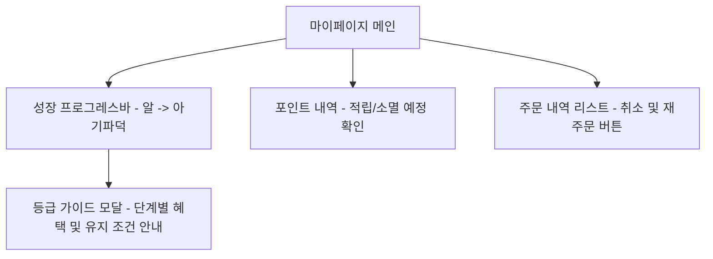
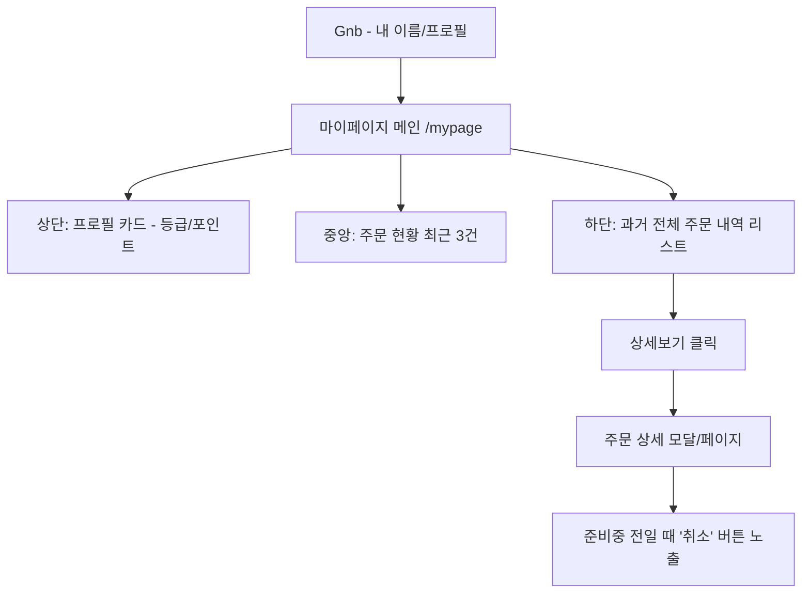

# 🐥 마이페이지(MyPage) 구현 청사진 (Blueprints)

본 문서는 N-Cafe 사용자를 위한 마이페이지 서비스 구축을 위한 기술적 설계 및 작업 순서도입니다.

---

## 1. 주요 기능 정의 (업데이트)

### [기본 기능]
*   **주문 내역 조회**: 본인이 주문한 모든 주문의 상태(결제완료, 준비중, 완료, 취소)와 상세 목록 확인.
*   **결제 취소(환불)**: '준비 중' 전 단계의 주문에 대해 포트원 V2 API를 통한 실제 결제 취소 처리.

### [🐥 파덕 성장 시스템 - 핵심]
*   **파덕 포인트 (Padeok Points)**: 결제 금액의 5% 적립. 쿠폰 대신 포인트를 쌓아 현금처럼 사용하거나 성장에 활용.
*   **성장 단계 가이드 (Growth Guide)**: 사용자가 현재 본인의 파덕 상태와 다음 단계까지 남은 포인트를 시각적으로 확인.
*   **단계별 혜택**: 등급이 높을수록 추가 적립률 상승, 전용 할인 쿠폰 바우처 지급 등.
*   **유지 및 강등 로직 (Retention)**: 
    *   30일 기준 주문 내역이 없거나 포인트 유지 조건을 만족하지 못할 경우 한 단계 아래로 강등(Down).
    *   사용자에게 "파덕이가 기운이 없어요! 🐣 맛있는 메뉴로 기운을 북돋아 주세요!" 라는 알림으로 재방문 유도.

---

## 2. 🦆 고라파덕 성장 가이드 (예시)

| 단계 | 명칭 | 조건 (포인트 누적) | 혜택 | 유지 조건 (30일) |
| :--- | :--- | :--- | :--- | :--- |
| **Lv.1** | **갓 태어난 알** | 신규 가입 | 기본 적립 1% | 없음 |
| **Lv.2** | **아기 파덕** | 1,000 P 이상 | 적립률 3% | 1회 이상 주문 |
| **Lv.3** | **청소년 골덕** | 5,000 P 이상 | 적립률 5% + 무료 배송 | 2회 이상 주문 |
| **Lv.4** | **현자 골덕** | 10,000 P 이상 | 적립률 10% + 월 1회 무료 음료 | 3회 이상 주문 |

---

## 3. 데이터 모델 및 API 설계 (업데이트)

### [Database 변경 사항]
*   `Member` 테이블: 
    *   `current_points`: 현재 사용 가능한 포인트
    *   `total_accumulated_points`: 상위 등급 산정용 누적 포인트
    *   `last_order_date`: 등급 유지 여부 판단을 위한 마지막 주문일
    *   `growth_level`: 현재 등급 (STRING or INT)

### [API 명세서]
| Method | Endpoint | 설명 |
| :--- | :--- | :--- |
| `GET` | `/api/orders/mine` | 로그인한 사용자의 주문 목록 상세 조회 |
| `POST` | `/api/orders/{paymentId}/cancel` | 특정 주문에 대한 결제 취소 요청 |
| `GET` | `/api/members/growth` | 내 현재 등급, 포인트, 다음 등급까지 필요 포인트 조회 |

---

## 4. 화면 설계 (UI/UX)

---

## 4. 구현 단계 (Phases)

### **Phase 1: 백엔드 기본 API (Current Week)**
1.  로그인 세션(SecurityContext)에서 USER_ID를 꺼내 주문 내역을 필터링하는 서비스 개발.
2.  OrderJpaEntity와 OrderItemJpaEntity를 조합하여 DTO 반환.

### **Phase 2: 환불 연동 (PortOne V2)**
1.  포트원 V2 관리자 시크릿 키를 이용한 Access Token 발급 로직.
2.  `/payments/{paymentId}/cancel` 명세에 따른 REST 요청 구현.
3.  부분 취소/전체 취소 대응 로직.

### **Phase 3: 프론트엔드 마이페이지 UI**
1.  `/app/mypage/page.tsx` 생성.
2.  `OrderCard` 공용 컴포넌트 제작 (재사용성 고려).
3.  Framer Motion 등을 활용한 부드러운 상태 전환 애니메이션.

---
**💡 Tip**: 고라파덕의 성장 단계(알 -> 파덕 -> 골덕)를 등급 시스템에 대입하면 유저가 더 재미를 느낄 수 있습니다! 🐤
