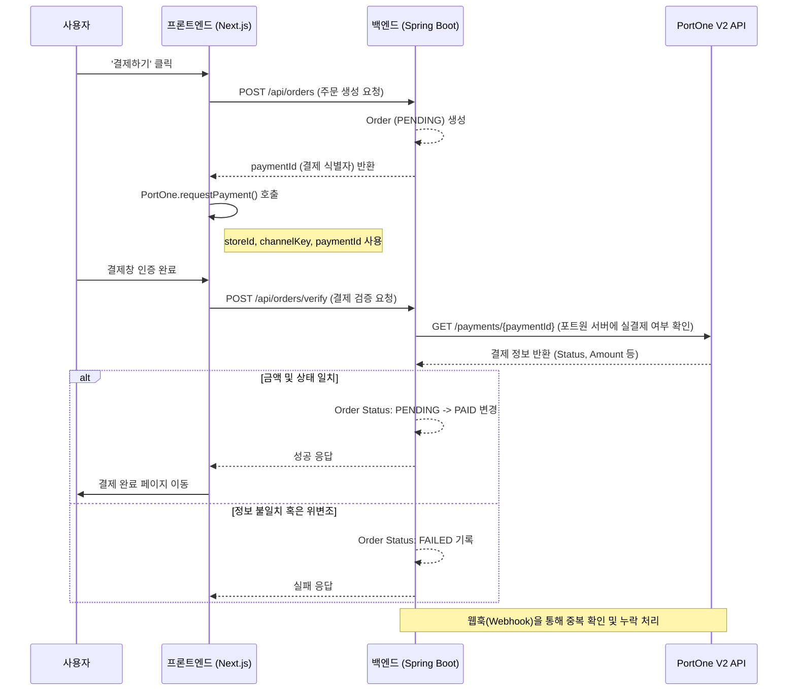

# 💳 결제 시스템 연동 구현 가이드 (PortOne V2)

본 문서는 N-Cafe의 실제 결제 연동을 위한 **PortOne V2 (신규 버전)** 기반 기술적 청사진입니다. 
V2는 기존 아임포트(V1) 대비 보안이 강화되고 선언적인 결제창 호출 방식을 제공합니다.

---

## 1. 개요
*   **플랫폼**: [PortOne V2](https://admin.portone.io/)
*   **검증 방식**: 서버 측 결제 완료 검증 (Server-to-Server) 및 웹훅(Webhook) 처리
*   **테스트 환경**: 포트원 V2 테스트 채널 (PG: html5_inicis 등) 연동

---

## 2. 데이터 모델 (Database Schema - V2 최적화)

결제는 비동기적으로 발생하며, 네트워크 장애 등으로 인해 클라이언트에서 보낸 정보가 서버에 도달하지 않을 수 있습니다. 따라서 **`paymentId`**를 중심으로 상태를 관리합니다.

### Order (주문 테이블)
| 컬럼명 | 타입 | 설명 |
| :--- | :--- | :--- |
| `id` | BIGINT | PK |
| `payment_id` | VARCHAR | 포트원 V2 결제 고유 식별자 (V1의 merchant_uid에 해당) |
| `member_id` | UUID | 주문자 ID (비회원 시 NULL) |
| `total_price` | INT | 최종 결제 금액 (배송비 포함) |
| `status` | ENUM | PENDING(대기), PAID(결제완료), FAILED(실패), CANCELLED(취소) |
| `receiver_name`| VARCHAR | 수령인 성함 |
| `receiver_phone`| VARCHAR | 연락처 |
| `address` | VARCHAR | 수령 주소 / 매장 정보 |
| `memo` | TEXT | 요청 사항 |
| `tx_id` | VARCHAR | 포트원 서버로부터 받은 거래 고유번호 (승인 후 기록) |

### OrderItem (주문 항목 상세)
*   주문 당시의 메뉴명, 옵션, 가격을 스냅샷 형태로 저장하여 추후 메뉴 정보가 변경되어도 과거 내역을 정확히 보존합니다.

---

## 3. 결제 시퀀스 다이어그램 (V2 정석 흐름)

---

## 4. PortOne V2 연동 핵심 재료
구현을 위해 다음 키값들을 환경변수로 관리합니다.

1.  **Store ID (가맹점 식별코드)**: 프론트엔드/백엔드 공통 사용
2.  **Channel Key (채널 키)**: V2에서 특정 결제 수단(PG)을 호출할 때 필수
3.  **API Secret (V2 전용)**: 백엔드에서 포트원 API를 호출할 때 사용

---

## 5. 단계별 구현 계획
1.  **Phase 1 (Backend)**: V2 스키마에 맞춘 `orders`, `order_items` 엔티티 구현 및 주문 생성 API 개발
2.  **Phase 2 (Frontend)**: `@portone/browser-sdk` 라이브러리 연동 및 결제 요청 로직 작성
3.  **Phase 3 (Verify)**: 백엔드에서 포트원 V2 REST API를 호출하여 결제 정합성 검증 로직 구현
4.  **Phase 4 (Webhook)**: 포트원 서버에서 보내는 결제 알림(Webhook) 처리 엔드포인트 구축

---
**💡 Tip**: 테스트 연동 시에는 실제 카드 결제가 아닌 '가짜 결제' 모듈을 사용하여 비용 발생 없이 무한한 테스트가 가능합니다.🧪
