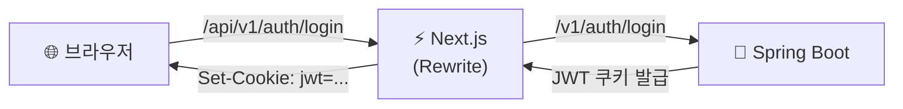
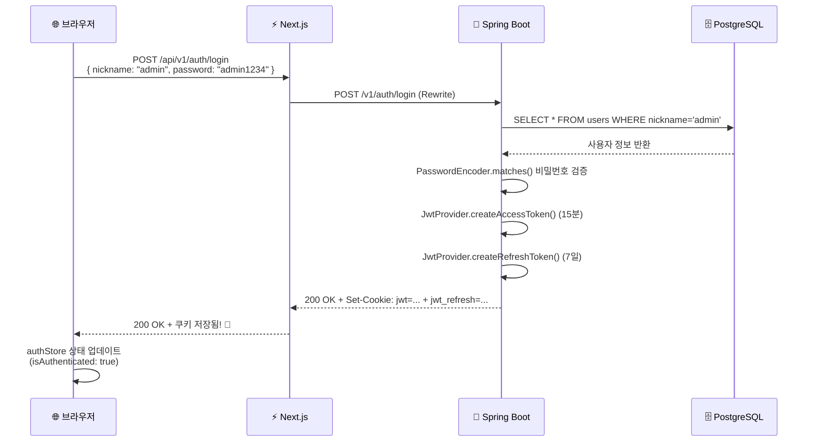
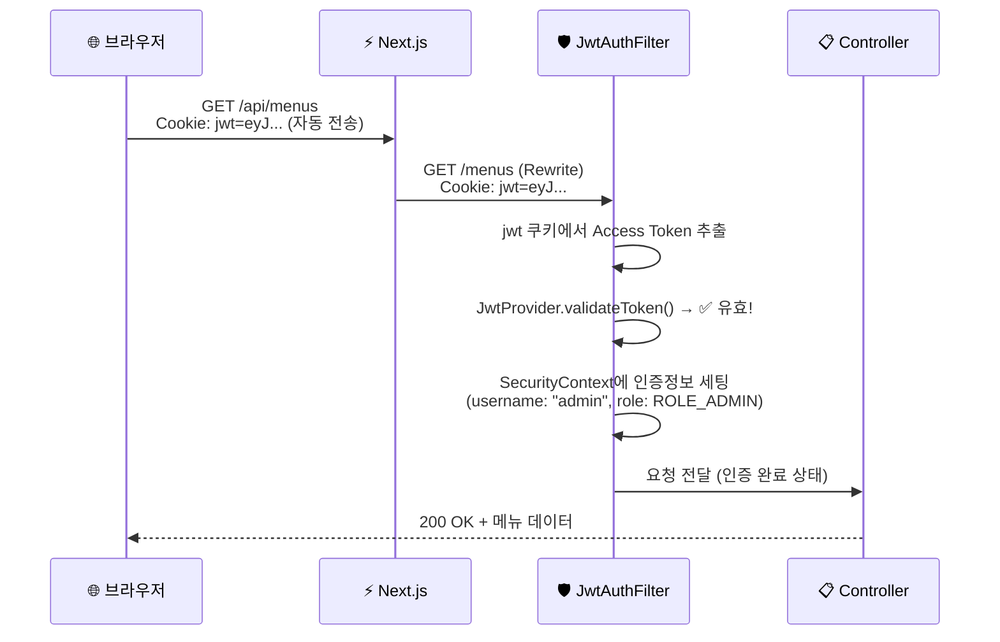
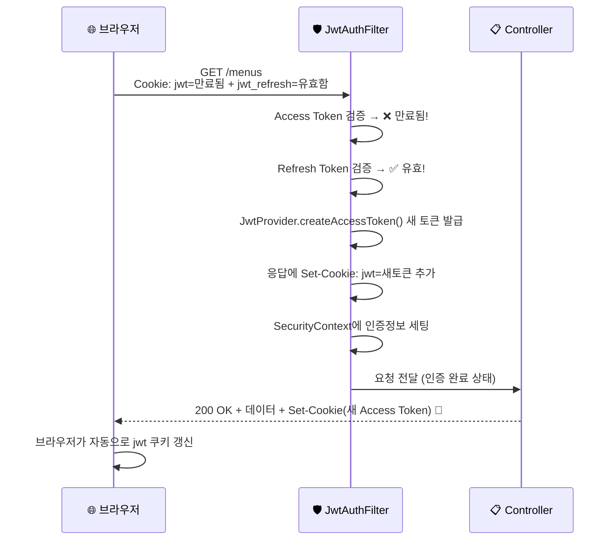
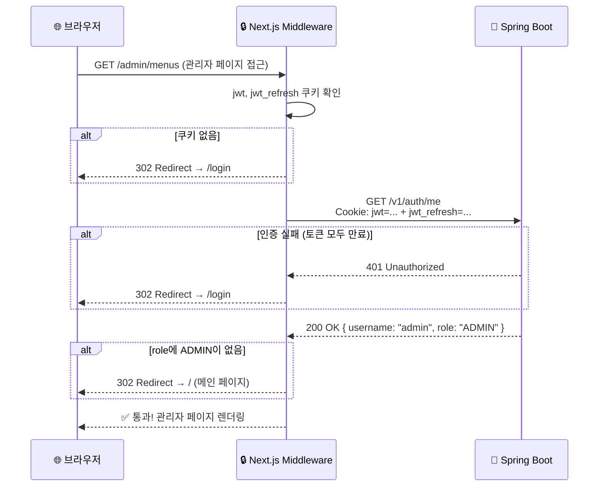
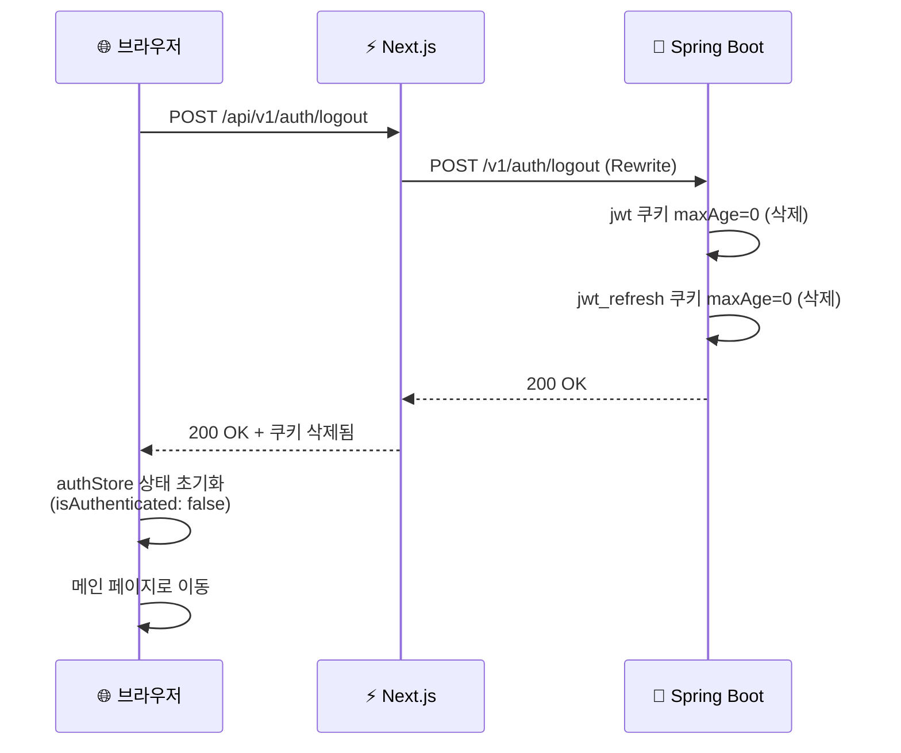
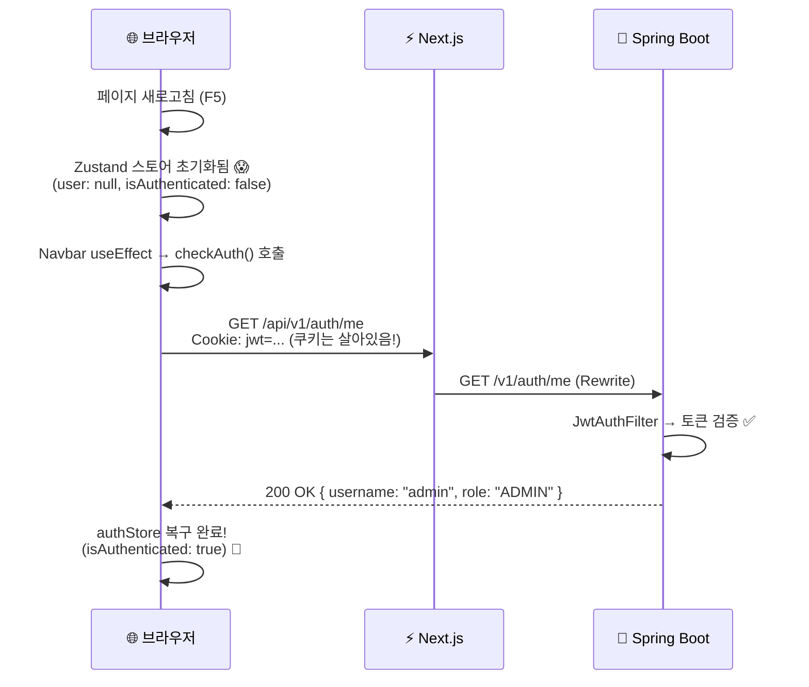

# 🔐 JWT 인증 & 권한 동작 흐름 가이드

> 고라파덕 카페 프로젝트의 JWT 기반 인증/인가 시스템 전체 동작 흐름을 정리한 문서입니다.

---

## 📌 전체 아키텍처



### 요청 경로 변환 규칙 (Next.js Rewrite)

| 프론트엔드 (브라우저) | Next.js Rewrite | 백엔드 (Spring Boot) |
|---|---|---|
| `POST /api/v1/auth/login` | `/api` 제거 | `POST /v1/auth/login` |
| `GET /api/v1/auth/me` | `/api` 제거 | `GET /v1/auth/me` |
| `POST /api/v1/auth/logout` | `/api` 제거 | `POST /v1/auth/logout` |
| `GET /api/menus` | `/api` 제거 | `GET /menus` |
| `GET /api/admin/menus` | `/api` 제거 | `GET /admin/menus` |

> [!IMPORTANT]
> 브라우저는 항상 `/api/...`로 요청합니다. Next.js의 `next.config.ts` rewrite 규칙이 `/api/` 접두사를 제거하고 Spring Boot(`localhost:8032`)로 전달합니다.

---

## 🗝️ 토큰 구조

### JWT 토큰 2종류

| 항목 | Access Token | Refresh Token |
|------|-------------|---------------|
| **쿠키 이름** | `jwt` | `jwt_refresh` |
| **유효기간** | 15분 | 7일 |
| **용도** | 매 요청마다 인증에 사용 | Access Token 자동 갱신용 |
| **HttpOnly** | ✅ (JS 접근 불가) | ✅ (JS 접근 불가) |
| **SameSite** | Lax (CSRF 방어) | Lax (CSRF 방어) |

### JWT 페이로드 (내용물)

```json
{
  "sub": "admin",        // 사용자 아이디 (nickname)
  "role": "ADMIN",       // 권한 (ADMIN 또는 USER)
  "type": "ACCESS",      // 토큰 종류 (ACCESS 또는 REFRESH)
  "iat": 1740636000,     // 발급 시간 (Unix Timestamp)
  "exp": 1740636900      // 만료 시간 (Unix Timestamp)
}
```

> [!NOTE]
> JWT에는 비밀번호 같은 민감 정보가 들어있지 않습니다. username, role 등 최소한의 식별 정보만 담습니다. 토큰 내용은 Base64로 누구나 디코딩할 수 있지만, 서명(Signature)이 있어서 위변조는 불가능합니다.

---

## 🔄 Flow 1: 로그인



### 관련 파일

| 순서 | 파일 | 역할 |
|------|------|------|
| 1 | [LoginForm.tsx](file:///Users/chaena-eun/Desktop/IBM_Test/ncafe-back/frontend/app/login/_components/LoginForm/LoginForm.tsx) | 사용자 입력 (nickname, password) |
| 2 | [page.tsx](file:///Users/chaena-eun/Desktop/IBM_Test/ncafe-back/frontend/app/login/page.tsx) | handleLogin → authStore.login() 호출 |
| 3 | [authStore.ts](file:///Users/chaena-eun/Desktop/IBM_Test/ncafe-back/frontend/stores/authStore.ts) | `fetch('/api/v1/auth/login')` 실행 |
| 4 | [next.config.ts](file:///Users/chaena-eun/Desktop/IBM_Test/ncafe-back/frontend/next.config.ts) | `/api/` 제거 → Spring Boot로 전달 |
| 5 | [AuthController.java](file:///Users/chaena-eun/Desktop/IBM_Test/ncafe-back/backend/src/main/java/com/newlecture/backend/auth/adapter/in/web/AuthController.java) | 로그인 처리, JWT 쿠키 발급 |
| 6 | [AuthService.java](file:///Users/chaena-eun/Desktop/IBM_Test/ncafe-back/backend/src/main/java/com/newlecture/backend/auth/application/AuthService.java) | DB 조회 + 비밀번호 검증 |
| 7 | [JwtProvider.java](file:///Users/chaena-eun/Desktop/IBM_Test/ncafe-back/backend/src/main/java/com/newlecture/backend/config/JwtProvider.java) | JWT 토큰 생성 |

---

## 🔄 Flow 2: 인증된 API 요청 (Access Token 유효)



> [!TIP]
> 브라우저는 쿠키를 **자동으로** 모든 요청에 포함시킵니다. 프론트엔드 코드에서 토큰을 직접 꺼내서 헤더에 붙일 필요가 없습니다!

---

## 🔄 Flow 3: Access Token 만료 → 자동 갱신



> [!IMPORTANT]
> 이 과정은 **사용자에게 완전히 투명(transparent)**합니다. 사용자는 토큰이 갱신되는 것을 전혀 알지 못합니다. 15분마다 자동으로 갱신되며, 7일 동안 재로그인 없이 서비스를 이용할 수 있습니다.

### 관련 파일

| 파일 | 역할 |
|------|------|
| [JwtAuthenticationFilter.java](file:///Users/chaena-eun/Desktop/IBM_Test/ncafe-back/backend/src/main/java/com/newlecture/backend/config/JwtAuthenticationFilter.java) | Access Token 만료 감지 → Refresh Token으로 자동 재발급 |
| [JwtProvider.java](file:///Users/chaena-eun/Desktop/IBM_Test/ncafe-back/backend/src/main/java/com/newlecture/backend/config/JwtProvider.java) | `isTokenExpired()` + `createAccessToken()` |

---

## 🔄 Flow 4: 권한 확인 (Admin 페이지 접근)



### 관련 파일

| 파일 | 역할 |
|------|------|
| [middleware.ts](file:///Users/chaena-eun/Desktop/IBM_Test/ncafe-back/frontend/middleware.ts) | `/admin/*` 경로 진입 시 JWT 쿠키 확인 + 백엔드에 권한 확인 요청 |
| [SecurityConfig.java](file:///Users/chaena-eun/Desktop/IBM_Test/ncafe-back/backend/src/main/java/com/newlecture/backend/config/SecurityConfig.java) | `.requestMatchers("/admin/**").hasRole("ADMIN")` |

---

## 🔄 Flow 5: 로그아웃



---

## 🔄 Flow 6: 페이지 새로고침 (세션 복구)



> [!NOTE]
> Zustand 상태는 새로고침하면 날아가지만, JWT 쿠키는 브라우저에 남아있습니다. `Navbar` 컴포넌트의 `useEffect`에서 `checkAuth()`를 호출하여 서버에 확인 후 상태를 복구합니다.

### 관련 파일

| 파일 | 역할 |
|------|------|
| [Navbar.tsx](file:///Users/chaena-eun/Desktop/IBM_Test/ncafe-back/frontend/components/landing/Navbar.tsx) | `useEffect → checkAuth()` 호출 |
| [authStore.ts](file:///Users/chaena-eun/Desktop/IBM_Test/ncafe-back/frontend/stores/authStore.ts) | `checkAuth()` → `GET /api/v1/auth/me` |

---

## 🛡️ 보안 방어 체계 요약

| 공격 유형 | 방어 수단 | 상태 |
|----------|----------|------|
| **XSS** (스크립트 삽입으로 토큰 탈취) | `HttpOnly` 쿠키 → JS 접근 불가 | ✅ 적용됨 |
| **CSRF** (다른 사이트에서 위조 요청) | `SameSite=Lax` → 외부 사이트 쿠키 미전송 | ✅ 적용됨 |
| **토큰 위변조** | HMAC-SHA256 서명 → 시크릿 키 없이 변조 불가 | ✅ 적용됨 |
| **토큰 탈취 후 악용** | Access Token 15분 만료 → 피해 시간 최소화 | ✅ 적용됨 |
| **비밀번호 유출** | Bcrypt 해싱 → DB에 평문 저장 안 함 | ✅ 적용됨 |
| **무차별 대입 공격** | (미구현) Rate Limiting 추가 가능 | ⏳ 추후 |

---

## 📂 인증 관련 파일 전체 목록

### Backend (Spring Boot)

```
backend/src/main/java/com/newlecture/backend/
├── config/
│   ├── SecurityConfig.java          ← Spring Security 설정 (Stateless, JWT 필터 등록)
│   ├── JwtProvider.java             ← JWT 토큰 생성/검증 유틸리티
│   └── JwtAuthenticationFilter.java ← 요청 필터 (토큰 검증 + 자동 갱신)
├── auth/
│   ├── adapter/
│   │   ├── in/web/
│   │   │   ├── AuthController.java  ← 로그인/로그아웃/회원가입 API
│   │   │   └── dto/
│   │   │       ├── LoginRequest.java
│   │   │       ├── LoginResponse.java
│   │   │       └── SignupRequest.java
│   │   └── out/persistence/
│   │       └── JdbcMemberRepository.java  ← users 테이블 JDBC 조회
│   ├── application/
│   │   ├── AuthService.java         ← 인증 비즈니스 로직
│   │   └── port/
│   │       ├── in/AuthUseCase.java  ← 인바운드 포트 (인터페이스)
│   │       └── out/MemberRepository.java ← 아웃바운드 포트 (인터페이스)
│   └── domain/
│       └── Member.java              ← 도메인 객체
└── resources/
    └── application.properties       ← JWT 시크릿 키, 만료시간 설정
```

### Frontend (Next.js)

```
frontend/
├── stores/
│   └── authStore.ts           ← Zustand 전역 상태 (login, logout, checkAuth)
├── middleware.ts               ← /admin 경로 권한 체크
├── next.config.ts              ← /api → Spring Boot rewrite 규칙
├── components/landing/
│   └── Navbar.tsx              ← useEffect → checkAuth() (새로고침 시 상태 복구)
└── app/
    └── login/
        ├── page.tsx            ← 로그인/회원가입 페이지
        └── _components/
            ├── LoginForm/
            │   └── LoginForm.tsx
            └── SignupForm/
                └── SignupForm.tsx
```

---

## 🔍 브라우저에서 확인하는 방법

### 1. 쿠키 확인
`F12` → **Application** 탭 → **Cookies** → `http://localhost:3000`

로그인 후 다음 2개의 쿠키가 보여야 합니다:
- `jwt` (Access Token, 15분)
- `jwt_refresh` (Refresh Token, 7일)

### 2. Network 요청 확인
`F12` → **Network** 탭 → 로그인 후 `login` 요청 클릭

- **Response Headers**에 `Set-Cookie: jwt=...` 와 `Set-Cookie: jwt_refresh=...` 확인
- **Request Headers**에 `Cookie: jwt=...` 자동 포함 확인

### 3. JWT 토큰 디코딩
쿠키 값을 복사 → [https://jwt.io](https://jwt.io) 에 붙여넣기 → Payload 확인

### 4. 자동 갱신 테스트
`application.properties`에서 Access Token 만료시간을 임시로 짧게 설정(예: 30초 = 30000)하면 자동 갱신을 빠르게 확인할 수 있습니다.
